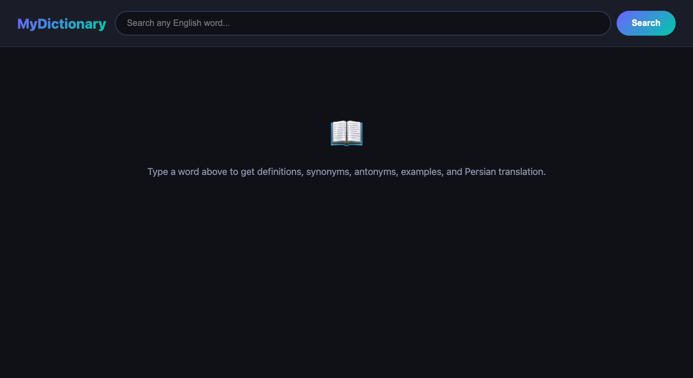

# MyDictionary

A live English dictionary web app with synonyms, antonyms, example sentences, audio pronunciation, and Persian (فارسی) translation.

**Live site:** https://thabamaso.github.io/MyDictionary

## Features

- **Definitions** — part of speech, multiple meanings
- **Synonyms** — color-coded tags
- **Antonyms (Opposites)** — color-coded tags
- **Example sentences** — real usage from the dictionary
- **Audio pronunciation** — click Listen to hear the word
- **Persian translation (فارسی)** — shown at the top next to the word
- **Live search** — results appear as you type (700ms debounce)
- **Responsive layout** — 2-column grid on wide screens, single column on mobile

## APIs Used

| API | Purpose |
|---|---|
| [Free Dictionary API](https://dictionaryapi.dev) | Definitions, synonyms, antonyms, examples, phonetics, audio |
| [MyMemory Translation API](https://mymemory.translated.net) | Persian (Farsi) translation |

Both APIs are free with no API key required.
